<div align="center">

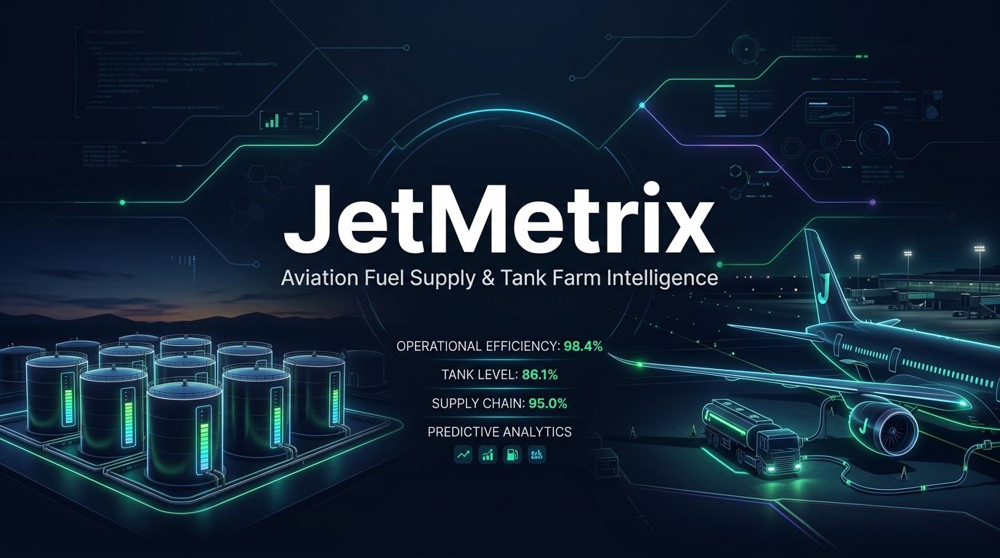

<br/><br/>


# JetMetrix (СГСМ-Акуа)

**Цифровая экосистема оперативного учета, мониторинга и контроля движения авиаГСМ**  
*Международный Аэропорт «Сухум» им. В. Г. Ардзинба (URSS)*

<p align="center">
  <a href="https://jet-metrix.vercel.app/"></a>
  <a href="https://react.dev/"></a>
  <a href="https://www.typescriptlang.org/"></a>
  <a href="https://vite.dev/"></a>
  <a href="https://tailwindcss.com/"></a>
  <a href="https://supabase.com/"></a>
  <a href="https://core.telegram.org/bots/api"></a>
</p>

[🌐 Онлайн-система (Production)](https://jet-metrix.vercel.app/) • [📖 Руководство администратора](Руководство_Администратора_JetMetrix.docx) • [📋 Чек-лист переноса](MOVING_CHECKLIST.md) • [📊 Отчет о тестировании](DEPLOYMENT_REPORT.md)

</div>

---

## 📑 Содержание

- [О проекте](#-о-проекте)
- [Ключевые модули и возможности](#-ключевые-модули-и-возможности)
  - [Интерактивная карта резервуарного парка](#1-интерактивная-карта-резервуарного-парка-tank-park-map)
  - [Аналитический Дашборд и Хронология операций](#2-аналитический-дашборд-и-хронология-операций)
  - [Динамика выдачи авиатоплива в ВС](#3-динамика-выдачи-авиатоплива-в-вс)
  - [Сквозные складские операции смены](#4-сквозные-складские-операции-смены)
  - [Отчеты, инвентаризация и экспорт документов](#5-отчеты-инвентаризация-и-экспорт-документов)
  - [Telegram-бот и мгновенные уведомления](#6-интеграция-с-telegram-ботом)
  - [Offline-First и синхронизация](#7-offline-first-и-высокая-автономность)
- [Галерея интерфейса](#-галерея-интерфейса)
- [Архитектура и стек технологий](#-архитектура-и-стек-технологий)
- [Структура репозитория](#-структура-репозитория)
- [Быстрый старт и локальный запуск](#-быстрый-старт-и-локальный-запуск)
- [Переменные окружения (.env)](#-переменные-окружения-env)
- [Ролевая модель и безопасность](#-ролевая-модель-и-безопасность)
- [История изменений (Changelog)](#-история-изменений-changelog)

---

## ✈️ О проекте

**JetMetrix (СГСМ-Акуа)** — это специализированная цифровая экосистема оперативного учета и сквозного контроля авиационного топлива для Службы горюче-смазочных материалов (СГСМ) Международного Аэропорта «Сухум».

Авиационное топливо — критически важный и дорогостоящий ресурс. Погрешность замера уровня даже на 1 миллиметр или изменение плотности на тысячные доли при перепадах температур влияют на сотни килограммов керосина. JetMetrix устраняет человеческий фактор, бумажную рутину и ошибки ручной интерполяции калибровочных таблиц, предоставляя персоналу склада и руководству аэропорта прозрачный, высокоточный инструмент учета в режиме реального времени.

### Решаемые задачи:
- **Высокоточные замеры**: расчет массы и объема топлива с автоматической интерполяцией по официальным калибровочным таблицам (РГС-50, РГС-100, РК-1, ж/д цистерны) с учетом фактической плотности и температуры.
- **Мониторинг парка в реальном времени**: интерактивная визуализация состояния всех резервуаров с контролем взлива метроштоком, остатков и свободного объема («сколько можно долить»).
- **Сквозная цепочка учета**: от прибытия ж/д цистерн и автоцистерн до выдачи в аэродромные топливозаправщики (ТЗА) и непосредственной заправки воздушных судов (ВС).
- **Аналитика и динамика заправок**: глубокий анализ интенсивности заправок по рейсам, бортам ВС и авиакомпаниям в литрах и килограммах.
- **Оповещения и автоматизация**: сменные отчеты, чеки, логирование административных корректировок и отправка сводок в рабочий Telegram-чат и ЦПУ аэропорта.

---

## 🚀 Ключевые модули и возможности

### 1. Интерактивная карта резервуарного парка (Tank Park Map)

<p align="center">
  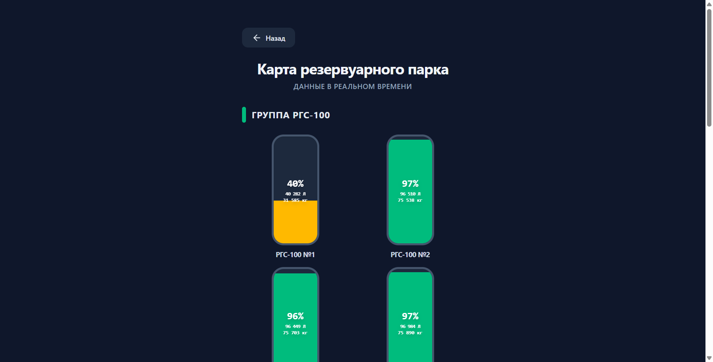
</p>

- **Мониторинг налива**: визуализация цилиндрических резервуаров групп РГС-100 и РГС-50 с цветовой индикацией заполнения (<20%, 20–80%, >80%).
- **Формула живых остатков**: автоматический расчет остатков на сервере:
  $$\text{Текущий остаток} = \text{Базовый замер} + \sum \text{Приемы} + \sum \text{Перекачки}_{\text{вх}} - \sum \text{Перекачки}_{\text{исх}} - \sum \text{Выдачи в ТЗА}$$
- **Досье резервуара**: всплывающая карточка с текущим объемом (л), массой (кг), температурой, плотностью, средним взливом в миллиметрах по последнему замеру метроштоком и точным расчетом резервной вместимости:

<p align="center">
  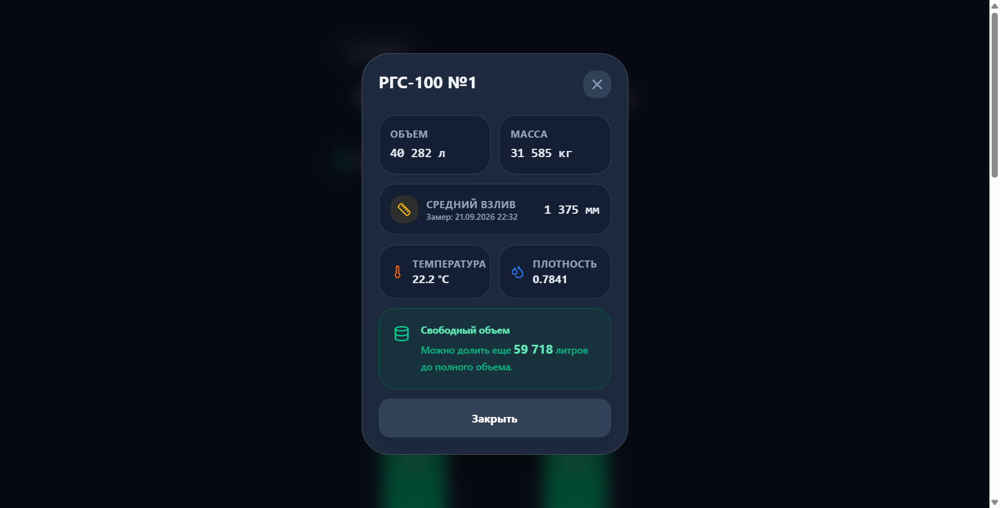
</p>

---

### 2. Аналитический Дашборд и Хронология операций

<p align="center">
  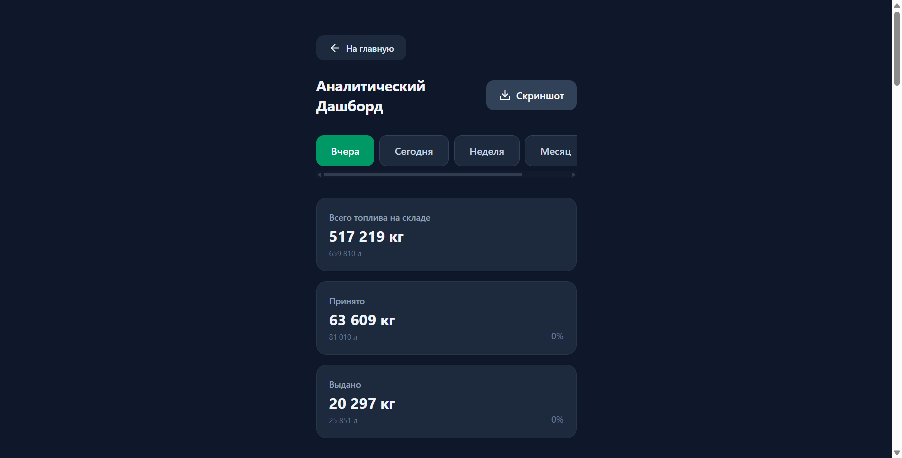
</p>

- **Складской баланс**: суммарный остаток топлива на складе в килограммах и литрах, суточный объем приема и выдачи.
- **Уровень топлива в ТЗА (Real-Time)**: наглядные индикаторы баков аэродромных топливозаправщиков (ТЗА-20 №173, №174) с расчетом запаса и процента емкости.
- **Графики оборота и плотности**: динамика перемещения авиатоплива и контроль плотности партии ($г/\text{см}^3$).
- **Хронология рабочей смены (Timeline)**: визуальная временная шкала с 05:00 до 23:00 с точками операций (заправки ВС, выдачи в ТЗА, замеры, сливы).
- **Живая лента событий**: протокол действий авиатехников на смене с детализацией по номерам контрольных талонов, времени и объемам.

---

### 3. Динамика выдачи авиатоплива в ВС

<p align="center">
  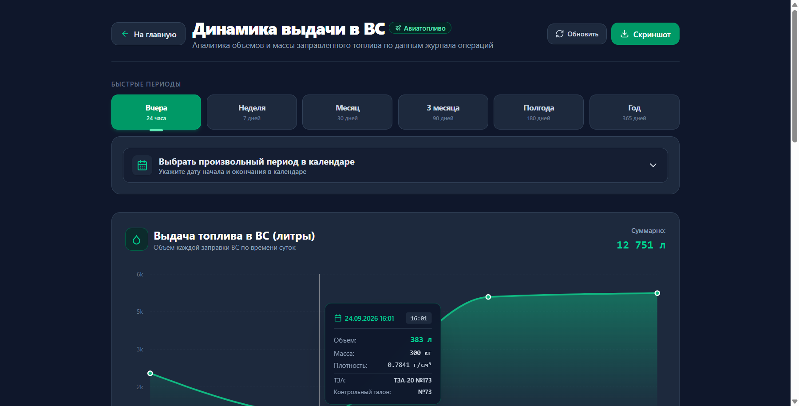
</p>

- **Два синхронизированных графика**: независимый учет в **литрах** (физический объем) и **килограммах** (коммерческая масса).
- **Быстрые периоды анализа**: мгновенное переключение: «Вчера» (24 ч), «Неделя» (7 дн), «Месяц» (30 дн), «3 месяца» (90 дн), «Полгода» (180 дн), «Год» (365 дн).
- **Умная агрегация**: для периодов от 3 месяцев система автоматически группирует точки помесячно без нагромождения дат.
- **Интерактивный календарь**: выбор произвольного диапазона дат через `react-day-picker` с формированием персональной аналитической сводки.
- **Сводные аналитические карточки**: суммарный объем/масса, число заправок ВС, средневзвешенная плотность керосина.

---

### 4. Сквозные складские операции смены

<p align="center">
  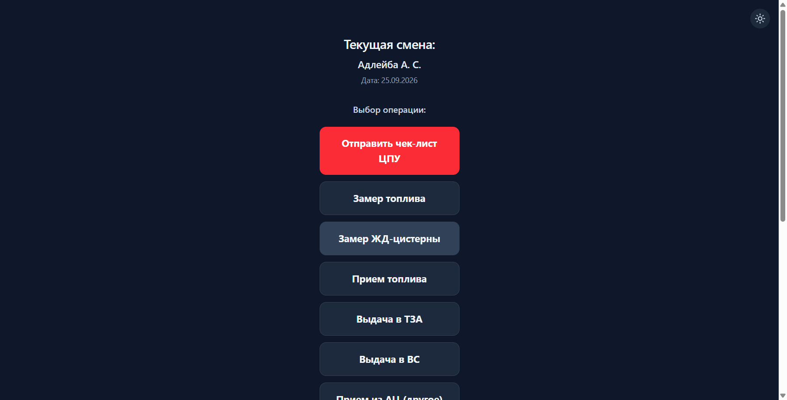
</p>

- **Прием топлива из ж/д цистерн**: фиксация номеров вагонов, накладных объемов/масс, замеры взлива метроштоком, определение подтоварной воды, расчет естественной убыли при транспортировке.
- **Прием топлива из автоцистерн (АЦ)**: учет поставок бензовозами.
- **Внутрискладская перекачка**: перемещение керосина между емкостями парка с пересчетом плотностей и уровней.
- **Выдача в ТЗА**: слив топлива со склада в расходные емкости топливозаправщиков с фиксацией счетчиков и плотности.
- **Заправка воздушных судов (Выдача в ВС)**:
  - Выбор ТЗА и исполнителя;
  - Номер рейса, бортовой номер самолета, авиакомпания;
  - Номер контрольного талона;
  - Показания счетчиков до и после заправки;
  - Плотность, температура, объем (л) и масса (кг).
- **Чек-лист готовности ЦПУ**: автоматическая отправка контрольного листа готовности смены в центральный пункт управления по SMTP.

---

### 5. Отчеты, инвентаризация и экспорт документов

<div align="center">
  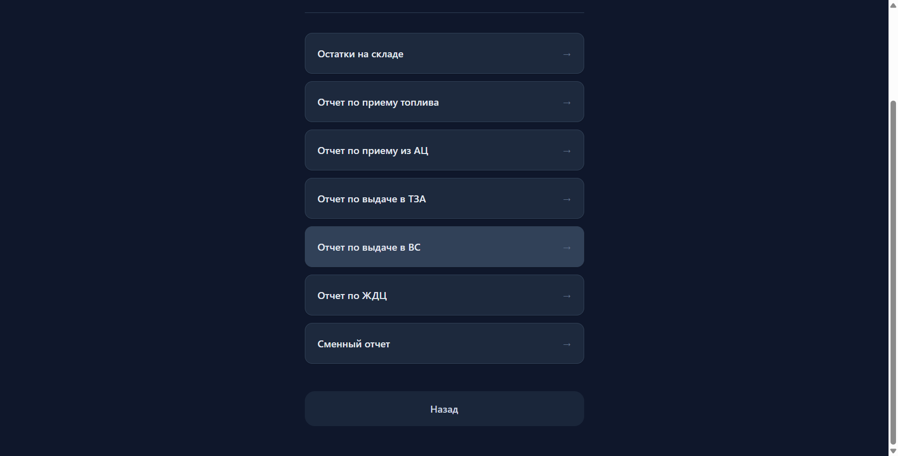
  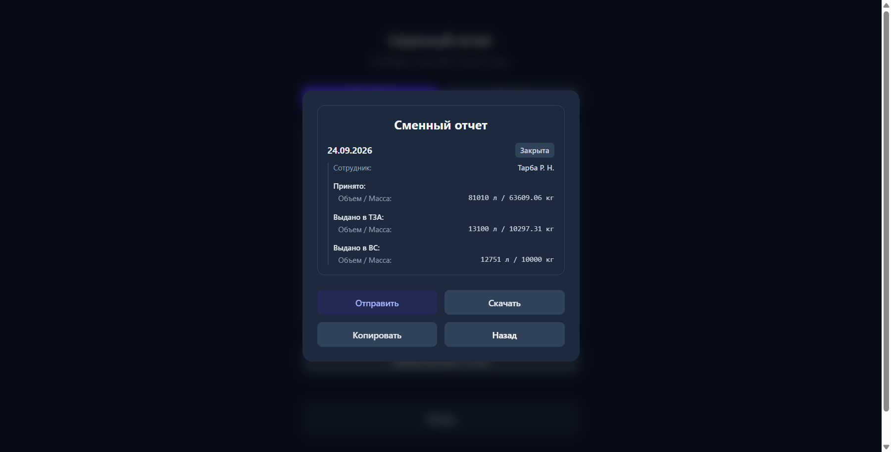
</div>

- **Двухрежимный сменный отчет**:
  - *Режим «По смене»*: отчет по конкретной рабочей смене сотрудника;
  - *Режим «По дате»*: агрегированный срез по выбранным календарным суткам.
- **Журнал остатков на складе**: инвентаризационный срез по каждому резервуару РГС-50 и РГС-100 (объем, масса, взлив, температура).
- **Экспорт в корпоративные форматы**:
  - 📊 Microsoft Excel (`.xlsx`) через `exceljs` и `xlsx`;
  - 📄 Adobe PDF (`.pdf`) через `jspdf`;
  - 📝 Microsoft Word (`.docx`) через библиотеку `docx`;
  - 🖨️ Печать электронных чеков и накладных заправки.

---

### 6. Интеграция с Telegram-ботом

- **Автоматические сменные отчеты**: при закрытии смены бот мгновенно отправляет подробную сводку (принято, выдано в ТЗА, выдано в ВС, остатки) руководству и диспетчерам.
- **Аудит административных действий**: оповещение о любых операциях «Корректировка операций» администратором с указанием полей «БЫЛО» и «СТАЛО».
- **Webhook API**: интеграция через серверлесс-эндпоинт `/api/telegram/webhook`.

---

### 7. Offline-First и высокая автономность

- **Специфика летного поля**: на удаленных стоянках воздушных судов и эстакадах связь может быть нестабильной.
- **Очередь транзакций**: при потере интернета приложение сохраняет все введенные замеры и операции в локальную защищенную очередь `IndexedDB` (`offlineQueue.ts`).
- **Автоматическая синхронизация**: при появлении Wi-Fi или мобильной сети очередь бесконфликтно синхронизируется с сервером с выводом тост-уведомлений.

---

## 🖼️ Галерея интерфейса

<div align="center">

| Главный экран (Dark Mode) | Интерактивная карта резервуаров |
|:---:|:---:|
| 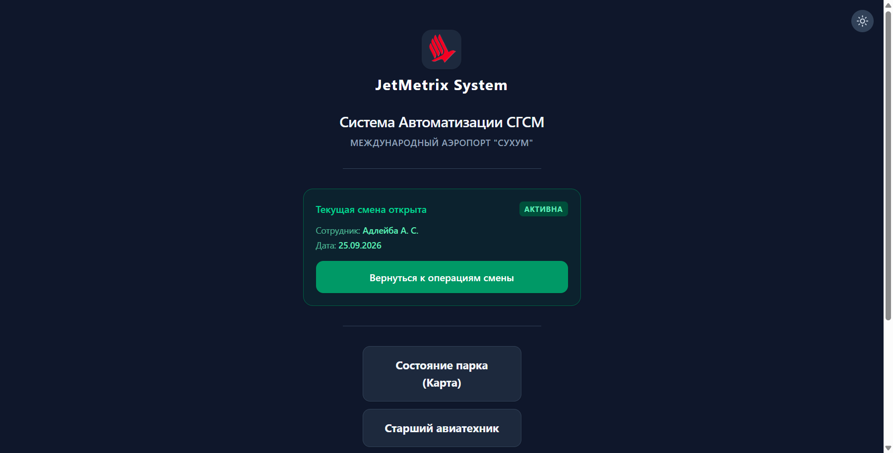 |  |

| Аналитика выдачи в ВС | Складской отчет по резервуарам |
|:---:|:---:|
|  | 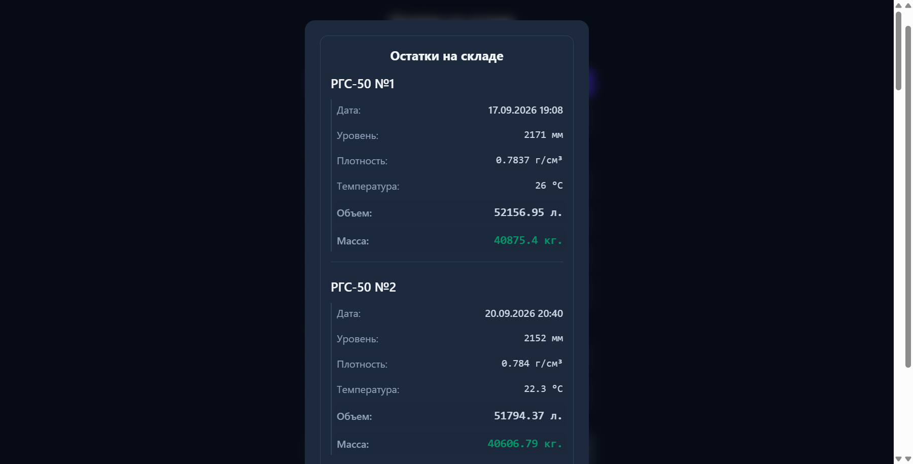 |

</div>

<details>
<summary><b>🔍 Посмотреть полный аналитический дашборд со всеми виджетами</b></summary>
<br/>
<p align="center">
  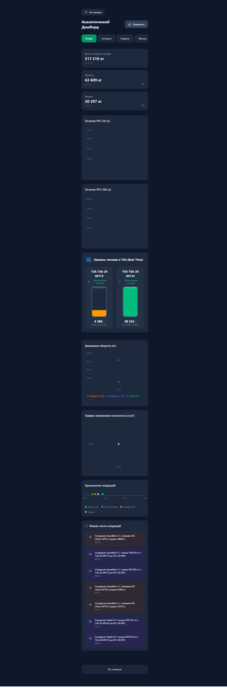
</p>
</details>

<details>
<summary><b>🔍 Посмотреть полную страницу динамики выдачи в ВС (литры + килограммы)</b></summary>
<br/>
<p align="center">
  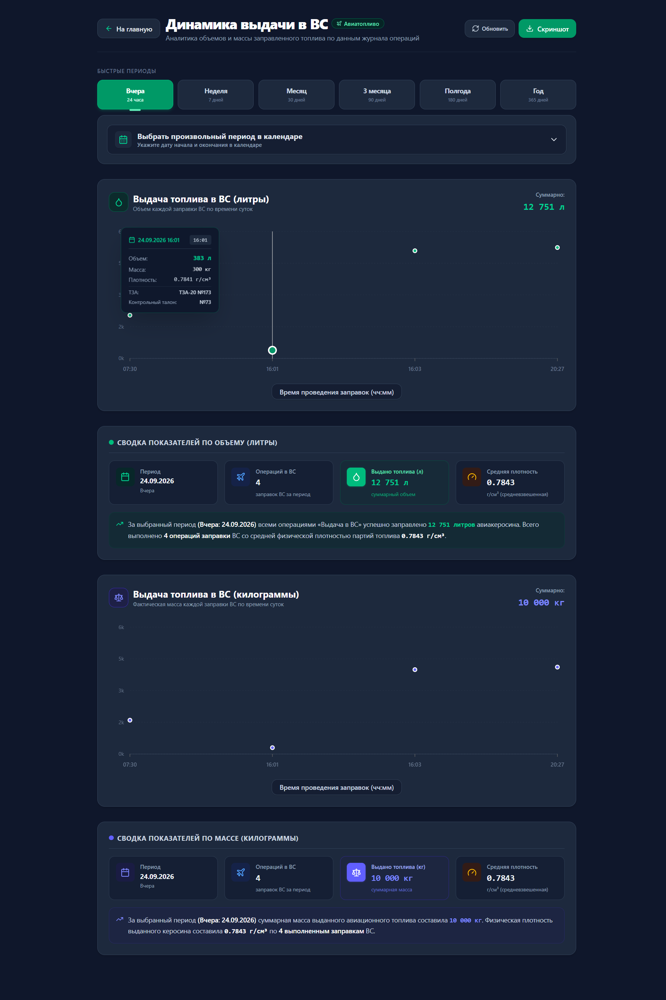
</p>
</details>

---

## 🛠️ Архитектура и стек технологий

```
                              ┌────────────────────────────────────────┐
                              │            Клиент (SPA / PWA)          │
                              │  React 19 • TypeScript • Tailwind v4   │
                              └───────────────────┬────────────────────┘
                                                  │
                                   ┌──────────────┴──────────────┐
                           (Online)│                             │(Offline)
                                   ▼                             ▼
                      ┌─────────────────────────┐   ┌─────────────────────────┐
                      │    Vercel Serverless    │   │       IndexedDB         │
                      │   api/[...path].ts      │   │    offlineQueue.ts      │
                      └────────────┬────────────┘   └─────────────────────────┘
                                   │
         ┌─────────────────────────┼─────────────────────────┐
         ▼                         ▼                         ▼
┌──────────────────┐      ┌──────────────────┐      ┌──────────────────┐
│  Supabase Cloud  │      │  Telegram Bot    │      │    SMTP Email    │
│   (PostgreSQL)   │      │    Webhook API   │      │  (Чек-листы ЦПУ) │
└──────────────────┘      └──────────────────┘      └──────────────────┘
```

### Стек технологий:

| Категория | Технологии |
|---|---|
| **Frontend** | [React 19](https://react.dev/), [TypeScript 5.8](https://www.typescriptlang.org/), [Vite 6](https://vite.dev/), [Tailwind CSS v4](https://tailwindcss.com/) |
| **UI-компоненты & Анимации** | [Lucide React](https://lucide.dev/), [Motion](https://motion.dev/), [Recharts](https://recharts.org/), [React Day Picker](https://daypicker.dev/) |
| **Backend & Serverless** | [Vercel Node Serverless](https://vercel.com/docs/functions), Node.js 22+, ES Modules |
| **Базы данных** | [Supabase](https://supabase.com/) (PostgreSQL в облаке), [SQLite](https://www.sqlite.org/) (`better-sqlite3` для автономного режима) |
| **Offline Storage** | IndexedDB (`offlineQueue.ts`) с авто-ретраями и PWA Service Worker (`sw.js`) |
| **Генерация документов** | [ExcelJS](https://github.com/exceljs/exceljs), [XLSX (SheetJS)](https://sheetjs.com/), [jsPDF](https://github.com/parallax/jsPDF), [docx](https://docx.js.org/) |
| **Скриншоты и экспорт графики** | `modern-screenshot`, `html-to-image` |
| **Внешние интеграции** | Telegram Bot API, Yandex SMTP (`nodemailer`), Google Gemini API |

---

## 📂 Структура репозитория

```
jet-metrix/
├── api/                           # Серверлесс-функции бэкенда
│   ├── [...path].ts               # Единый роутер API
│   ├── _handlers/                 # Обработчики эндпоинтов (приемы, выдачи, склад, аналитика)
│   └── _lib/                      # Подключение к БД Supabase, Telegram, утилиты
├── docs/                          # Презентационные материалы и скриншоты
│   ├── assets/                    # Логотипы, фирменный баннер
│   └── screenshots/               # Скриншоты реального интерфейса
├── public/                        # Статические файлы, манифест PWA, service worker
├── src/                           # Исходный код фронтенда (React 19)
│   ├── components/                # Компоненты страниц, форм, графиков и дашбордов
│   │   ├── TankParkMap.tsx        # Интерактивная карта резервуарного парка
│   │   ├── Dashboard.tsx          # Аналитический дашборд
│   │   ├── DispensingVSDynamics.tsx # Динамика выдачи топлива в ВС
│   │   ├── ShiftReport.tsx        # Сменные отчеты
│   │   ├── FuelDispensingVS.tsx   # Заправка воздушных судов
│   │   └── ...                    # Замеры, приемы, внутрискладские перекачки
│   ├── context/                   # React Context (темы оформления, тост-уведомления)
│   ├── data/                      # Модели данных, калибровки, справочники
│   └── utils/                     # OfflineQueue, экспорт Excel/PDF, конвертеры
├── supabase/                      # Схема БД PostgreSQL и миграции
├── chat_list.md                   # Журнал рабочих сессий и контекста
├── MOVING_CHECKLIST.md            # Чек-лист переноса на новый хостинг / сервер
├── DEPLOYMENT_REPORT.md           # Отчет о сборке, деплое и валидации
└── package.json                   # Зависимости и скрипты проекта
```

---

## ⚡ Быстрый старт и локальный запуск

### Требования:
- **Node.js** версии 20.x или выше (рекомендуется 22+)
- Менеджер пакетов **npm**

### 1. Клонирование репозитория
```bash
git clone https://github.com/Mincorey/jet-metrix.git
cd jet-metrix
```

### 2. Установка зависимостей
```bash
npm install
```

### 3. Настройка переменных окружения
Создайте файл `.env` в корне проекта (на основе `.env.example`):
```bash
cp .env.example .env
```
Заполните параметры доступа к Supabase и SMTP почте.

### 4. Запуск локального сервера разработки
```bash
npm run dev
```
Приложение откроется по адресу `http://localhost:5173/`.

### 5. Сборка для production
```bash
npm run build
```
Скомпилированный бандл формируется в каталоге `dist/`.

---

## 🔐 Переменные окружения (.env)

| Переменная | Описание | Обязательная |
|---|---|:---:|
| `SUPABASE_URL` | URL инстанса базы данных Supabase | Да |
| `SUPABASE_SERVICE_ROLE_KEY` | Сервисный ключ доступа с правами записи | Да |
| `SMTP_USER` | Email аккаунта для отправки чек-листов (Yandex) | Да |
| `SMTP_PASS` | Пароль приложения для SMTP-авторизации | Да |
| `SMTP_TO` | Email получателя оперативных чек-листов ЦПУ | Да |
| `GEMINI_API_KEY` | *(Опционально)* Ключ Google Gemini API | Нет |

> [!NOTE]
> Настройки Telegram-бота (токен и идентификаторы рабочих чатов) конфигурируются непосредственно через веб-интерфейс в «Панели Администратора» и сохраняются в таблице `Settings` базы данных.

---

## 👥 Ролевая модель и безопасность

Система спроектирована с учетом строгих требований к авиационной безопасности:

1. **Авиатехник (Смена)**:
   - Ввод операционных данных: замеры метроштоком, приемы, заправки ВС и ТЗА.
   - Персональная ответственность: каждая операция связывается с ID сотрудника и номером смены.
2. **Старший авиатехник**:
   - Авторизация по PIN-коду.
   - Доступ к внутрискладским перекачкам, формированию сменных рапортов и инвентаризации парка.
3. **Администратор системы**:
   - Управление справочниками сотрудников, калибровочными таблицами резервуаров.
   - Корректировка ошибочно введенных сменных операций с обязательным аудитом (логированием «БЫЛО / СТАЛО») и уведомлением в Telegram.
   - Настройка Telegram-бота и системных параметров.

---

<details>
<summary><b>📜 История изменений (Changelog)</b></summary>
<br/>

### 2026-09-25
- **Оформление репозитория**: Создан высококачественный баннер, структурирована документация, добавлены реальные скриншоты ключевых модулей, бейджи и подробное описание архитектуры.

### 2026-09-18
- **Карта резервуарного парка**: В модальное досье резервуара интегрирован вывод «Среднего взлива (уровня топлива)» в мм по последним замерам метроштоком с датой и временем.

### 2026-09-17
- **Динамика выдачи в ВС**: Добавлен новый аналитический модуль с фильтрами («Вчера», «Неделя», «Месяц», «3 месяца», «Полгода», «Год»), интерактивным календарем `react-day-picker` и двумя синхронными графиками (литры и килограммы). Полная адаптация темной и светлой тем.

### 2026-05-20
- **Целостность данных смен**: Решена проблема потери привязки операций при перезагрузке планшета через функцию `loadOpenWorkdaysFromDB`. Внедрен двухрежимный сменный отчет («По смене» / «По дате»).

### 2026-03-21
- **UI/UX**: Добавлена кнопка «На главную» вверху Дашборда для удобной навигации.
- **UI/UX (Mobile)**: «Умный ввод» для полей плотности, автоматическая подстановка `inputMode="decimal"` для мобильных клавиатур на планшетах.
- **Хронология**: Временная шкала адаптирована под рабочий интервал смены (05:00 - 23:00).

### 2026-03-20
- **Карта парка**: Запуск первой версии интерактивной карты резервуаров с анимацией налива.
- **Бэкенд**: Эндпоинт `/api/park-state` для расчета баланса топлива в реальном времени.

### 2026-03-19
- **Перекачки**: Реализован модуль «Внутрискладская перекачка» между резервуарами парка.
- **Отчеты**: Автоматический учет объемов перекачек в сменных рапортах и отчетах по приему.

### 2026-03-14
- **Telegram-бот**: Добавлен модуль конфигурации Telegram-бота и отправки сменных уведомлений.

### 2026-02-26
- **Инициализация**: Старт разработки цифровой системы учета авиаГСМ JetMetrix (SGSM-Akua).

</details>

---

<div align="center">

**JetMetrix** — Надежность, безопасность и миллиметровая точность учета авиационного топлива.  
Разработано для **Международного Аэропорта «Сухум» им. В. Г. Ардзинба**.

</div>
